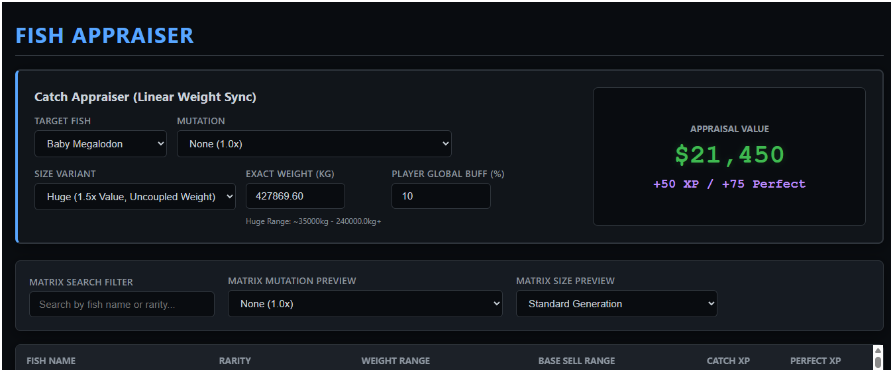
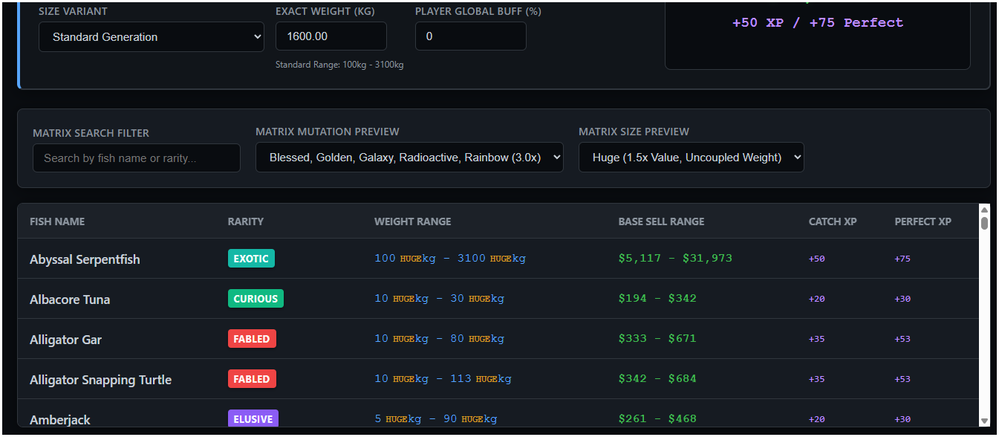

# 🐟 Fish! Appraiser Engine

[](https://nodejs.org/)
[](https://developer.mozilla.org/en-US/docs/Web/JavaScript)
[](#)

A high-performance, zero-dependency local web engine built to reverse-engineer and calculate the exact dynamic economy of the VRChat world **Fish!**. 

*I was bored and wanted something to do during my down time at work, so i built an engine that runs in nodeJS because I wanted a mathematically perfect companion app that didn't rely on bloated spreadsheets.*

## 📸 Engine Preview

<p align="center">
  
  
</p>

## 🚀 Features

* **Real-Time Catch Appraiser:** Uses linear interpolation (Lerp) to map the exact visual weight of your catch to its precise decimal coin value within the game's hidden floor/ceiling thresholds.
* **Dynamic 'Huge' Scaling:** Automatically detects and uncouples weight boundaries for "Huge" modifier catches, mathematically accommodating the game's inflated randomizer.
* **Global Buff Injection:** Input your active account modifiers (e.g., keep increasing by 1 until it matches the shop after base calculations are done, currently i have a 10% buff somewhere and asked the devs to check where and will update this later as to where it came from) to perfectly sync the engine's output with your in-game shop UI.
* **Decoupled Data Architecture:** Game state data is isolated in JSON payloads (`fish_data.json` & `modifiers_data.json`). When the game receives a balance patch, simply update the JSON files without ever touching the frontend code.
* **Zero-Dependency Backend:** Runs on a native Node.js HTTP server. No `package.json`, no `npm install`, no `node_modules` black hole.
* **Zero-File Favicon:** Uses a programmatic, server-side SVG interception to serve a scalable tab icon without cluttering the repository with binary `.ico` files.

## 📂 Architecture & Topology

The application relies on a strict separation of concerns (Structure, Presentation, Logic, and Data):

```text
/WikiFish-Engine
 │-- server.js              # Native Node.js web server & routing
 │-- index.html             # UI Structure & Dashboard
 │-- style.css              # Dark mode UI & Rarity color matrix
 │-- app.js                 # Calculation engine & asynchronous data ingestion
 │
 └── /data                  # Decoupled Game State
      │-- fish_data.json       # Master entity list (Base weights, Prices, XP)
      │-- modifiers_data.json  # Fixed scalar arrays for Mutations & Sizes
