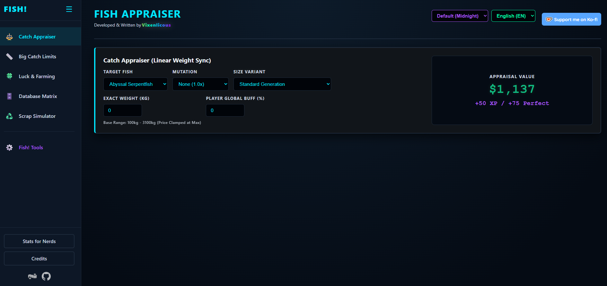
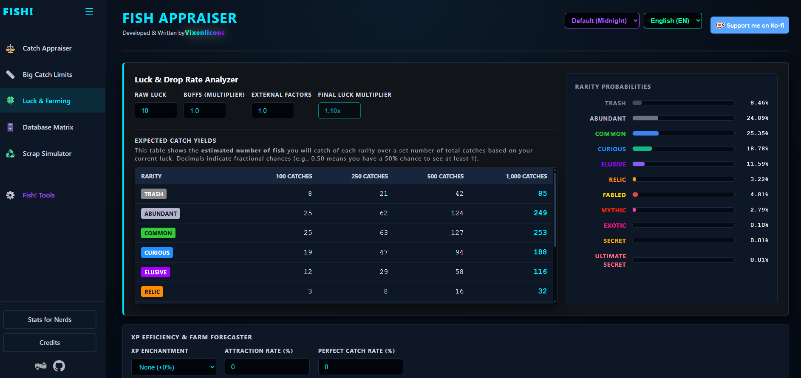
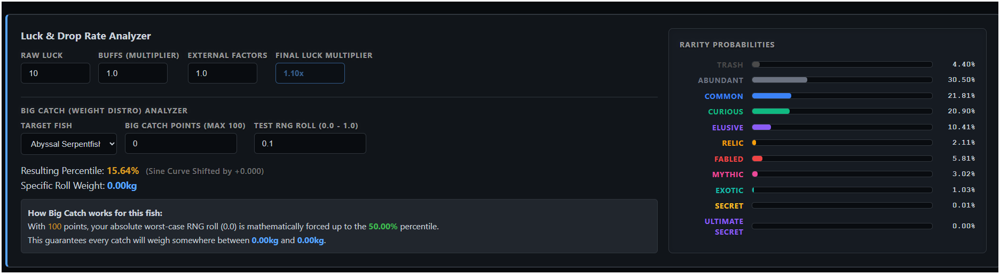

# 🐟 Fish! Appraiser Engine

[](https://nodejs.org/)
[](https://developer.mozilla.org/en-US/docs/Web/JavaScript)
[](#)

A high-performance, zero-dependency local web engine built to reverse-engineer and calculate the exact dynamic economy of the VRChat world **Fish!**. 

> *I was bored and wanted something to do during my down time at work, so I went a little too far for a fishing game lol.* — **Vixenlicious**

---

## 📑 Table of Contents
1. [Installation & Setup](https://github.com/VixenCreations/Fish-Appraiser-Engine#%EF%B8%8F-installation--setup)
2. [Usage & Navigation](https://github.com/VixenCreations/Fish-Appraiser-Engine#-usage--navigation)
3. [Server Configuration (Local & Production SSL)](https://github.com/VixenCreations/Fish-Appraiser-Engine#%EF%B8%8F-server-configuration)
4. [Engine Previews](https://github.com/VixenCreations/Fish-Appraiser-Engine#-engine-previews)
5. [Core Features & Technical Capabilities](https://github.com/VixenCreations/Fish-Appraiser-Engine#-core-features--technical-capabilities)
6. [Architecture & Topology](https://github.com/VixenCreations/Fish-Appraiser-Engine#-architecture--topology)
7. [The Nerd Stuff: Reverse-Engineered Mechanics](https://github.com/VixenCreations/Fish-Appraiser-Engine#-the-nerd-stuff-reverse-engineered-mechanics)

---

## 🛠️ Installation & Setup

This engine runs entirely on native Node.js modules (`http`, `fs`, `path`, `https`). There are **no dependencies** to install (`npm install` is not required). Ensure you have Git and Node.js installed on your system before proceeding.

### 🪟 Windows Setup
1. Open **Command Prompt** or **PowerShell**.
2. Clone the repository and enter the directory:
```cmd
git clone https://github.com/VixenCreations/Fish-Appraiser-Engine.git
cd Fish-Appraiser-Engine
```
3. Start the local server:
```cmd
node server.js
```
*(Note: If updating from an older version, simply run `update.bat`)*

### 🐧 Linux Setup (Ubuntu/Debian)
1. Open your terminal. If you don't have Git and Node.js installed, grab them first:
```bash
sudo apt update
sudo apt install git nodejs -y
```
2. Clone the repository and enter the directory:
```bash
git clone https://github.com/VixenCreations/Fish-Appraiser-Engine.git
cd Fish-Appraiser-Engine
```
3. Start the local server:
```bash
node server.js
```
*(Note: If updating from an older version, simply run `./update.sh`)*

[⬆ Back to Top](https://github.com/VixenCreations/Fish-Appraiser-Engine#-table-of-contents)

---

## 🌐 Usage & Navigation

Once your terminal confirms the server is online, open your web browser and navigate to:

* **The Main Appraiser:** `http://localhost:8080`
  * Calculate catch values, forecast XP efficiency, and analyze rarity drop rates based on your active in-game buffs.
* **The Data Miner Terminal:** `http://localhost:8080/tools`
  * A dedicated reverse-engineering sandbox. Input raw screen data from mutated catches to automatically strip multipliers, reverse the Sine curve, and validate true source-code integers against the community JSON database.

[⬆ Back to Top](https://github.com/VixenCreations/Fish-Appraiser-Engine#-table-of-contents)

---

## ⚙️ Server Configuration

By default, the engine runs locally on port `8080`. You can override this by creating a `.env` file in the root directory. The engine natively supports secure live-web deployments via dynamic SSL toggling.

**Example `.env` (Production Deployment):**
```env
PORT=443
HOST=yourdomain.com
CACHE_MAX_AGE=86400

# Set to 'true' to enable HTTPS for live web deployment
USE_SSL=true
SSL_KEY=./certs/privkey.pem
SSL_CERT=./certs/fullchain.pem
```

[⬆ Back to Top](https://github.com/VixenCreations/Fish-Appraiser-Engine#-table-of-contents)

---

## 📸 Engine Previews

<p align="center">
  
  
  
  
</p>

[⬆ Back to Top](https://github.com/VixenCreations/Fish-Appraiser-Engine#-table-of-contents)

---

## 🚀 Core Features & Technical Capabilities

* **Reverse-Engineering Terminal:** A completely standalone `/tools` suite for spreadsheet maintainers. Automatically normalizes economy data, strips "Huge" and mutation multipliers, and performs algebraic diff-checks to expose inaccuracies in the community data.
* **Developer-Verified Catch Appraiser:** Uses linear interpolation (Lerp) to map the exact physical weight of your catch to its precise decimal coin value. 
* **XP Efficiency & Farm Forecaster:** End-to-end predictive analytics. Cross-references your live RNG rarity drop-tables against piecewise linear interpolated catch-cycle times to output your exact, dynamic average XP/Hour and XP/Minute.
* **Decoupled Data Architecture:** Game state data is isolated in JSON payloads. When the game receives a balance patch, simply update the JSON files in the `/data/` folder without ever touching the frontend code.
* **Zero-File Favicon:** Uses programmatic, server-side SVG interception to serve a scalable, high-resolution tab icon without cluttering the repository with binary `.ico` files.

[⬆ Back to Top](https://github.com/VixenCreations/Fish-Appraiser-Engine#-table-of-contents)

---

## 📂 Architecture & Topology

The application relies on a strict separation of concerns (Structure, Logic, and Data) while isolating the frontend UI from the backend payloads for maximum security.

```text
/Fish-Appraiser-Engine
 │-- .env                   # Network configuration & SSL overrides (Optional)
 │-- server.js              # Native Node.js web server & custom router
 │-- update.bat             # Windows updater script
 │-- update.sh              # Linux updater script
 │-- package.json           # Project metadata
 │
 ├── /data                  # Decoupled Game State (The Database)
 │    │-- fish_data.json       # Master entity list (Weights, Prices, XP)
 │    └── modifiers_data.json  # Fixed scalar arrays for Mutations & Sizes
 │
 ├── /web                   # Frontend UI & Logic
 │    │-- index.html           # Main Appraiser Dashboard
 │    │-- tools.html           # Data Miner Reverse-Engineering Terminal
 │    │-- style.css            # Main UI Theme
 │    │-- tools.css            # Midnight Terminal Theme
 │    │-- app.js               # Core appraisal & forecasting engine
 │    │-- tools.js             # Data Miner reverse-algebra engine
 │    └── /assets/             # Static branding images
 │
 └── /gitpreviews           # Documentation images
```

[⬆ Back to Top](https://github.com/VixenCreations/Fish-Appraiser-Engine#-table-of-contents)

---

## 🔬 The Nerd Stuff: Reverse-Engineered Mechanics

During the development of this engine, several core mechanics of the game's hidden source code were successfully reverse-engineered. The engine strictly adheres to these mathematical truths.

### 1. The Core Equation (Sine Curve)
Fish weights are not rolled linearly. The game rolls a hidden decimal (0.0 to 1.0), applies your Big Catch points as a shift, and plots it on a `Math.sin()` ease-out curve to bias catches toward the lower end of the weight spectrum.

* **The Shift:** `EffectiveRoll = clamp(RandomRoll + (RodBC / 300), 0.0, 1.0)`
* **The Curve:** `WeightPercent = Math.sin(EffectiveRoll * (Math.PI / 2))`
* **The Result:** Rolling a `0.5` internally does not yield a 50% weight fish; it yields a `~70.7%` weight fish. True 100% "Perfect" catches require an exact `1.0` float roll, making them exponentially rarer than linear math would suggest.

### 2. The Big Catch Shift (Floors & Ceilings)
The "Big Catch" rod stat does not multiply weight; it acts as a hard floor shift to the base RNG roll. `1 Big Catch Point = +0.00333...` to the internal RNG.

* **The Floor Effect (Positive Buffs):** Because the effective roll floor-caps at `0.0`, positive points make it mathematically impossible to reach the bottom of the curve.
  * *Example:* If you have **+90 Big Catch**, your minimum possible effective roll is `0.3` (0.0 + 0.3). `Math.sin(0.3 * (π / 2)) = 0.4539`. You can never catch a fish smaller than **45.39%** of its potential size range.
* **The Ceiling Effect (Negative Penalties):** Because the effective roll hard-caps at `1.0`, negative points make it mathematically impossible to reach the top of the curve.
  * *Example:* If you have **-90 Big Catch**, your maximum possible effective roll is `0.7` (1.0 - 0.3). `Math.sin(0.7 * (π / 2)) = 0.8910`. You can never catch a fish larger than **89.10%** of its true maximum size.

### 3. Reverse-Algebra (Solving for True Stats)
You do not need to remove stats to find a fish's true values. By logging your extreme highs and lows, we can reverse the math for both the Ceiling and the Floor.

```text
// SCENARIO A: Solving Max Weight (Using a Negative Penalty)
// Ex: Caught a 1.00kg max fish at -90 Penalty (Min is known 0.1kg)
1. MaxPercentile (-90) = 0.8910
2. TrueBaseMax = ((ObservedMax - BaseMin) / MaxPercentile) + BaseMin
> ((1.00 - 0.1) / 0.8910) + 0.1 = 1.11kg (True Max)

// SCENARIO B: Solving Min Weight (Using a Positive Buff)
// Ex: Caught a 0.56kg min fish at +90 Buff (Max is known 1.11kg)
1. MinPercentile (+90) = 0.4539
2. TrueBaseMin = (ObservedMin - (BaseMax * MinPercentile)) / (1 - MinPercentile)
> (0.56 - (1.11 * 0.4539)) / (1 - 0.4539) = 0.10kg (True Min)
```

### 4. The Economy Engine (Solving True Prices)
Price scales linearly between `baseFloor` (at Min Weight) and `baseCeil` (at Max Weight). By catching a "Tiny" mutation (which forces weight to 0.0kg), we force the price equation to extrapolate backward, revealing the exact coin-value per kilogram.

```text
// SCENARIO: Caught a 0.0kg Tiny ($29 value) and a 0.1kg Normal ($31 value)
// The fish has a known Base Max Weight of 0.5kg
1. Weight Difference = 0.1kg - 0.0kg = 0.1kg
2. Price Difference = $31 - $29 = $2
3. Scaling Rate = $2 / 0.1kg = $20 per 1.0kg

// Solving True Base Floor (Price at known Min Weight: 0.1kg)
> BaseFloor = $31

// Solving True Base Ceil (Price at known Max Weight: 0.5kg)
4. Remaining Weight to Max = 0.5kg - 0.1kg = 0.4kg
5. Max Weight Value = 0.4kg * $20 = $8
> True Base Ceil = $31 (Floor) + $8 = $39
```

### 5. The Hardware Cap (Rod Weight Limits)
Every fishing rod in the game has a built-in `Max Weight` stat (e.g., the Stick and String caps at 5kg). This acts as a hard ceiling on what you can catch.

> 🛑 **DATA WARNING:** If a fish's natural calculated weight exceeds your rod's capacity, your data will be artificially flatlined. **Always ensure your rod's Max Weight is significantly higher than the fish you are testing**, or your reverse-algebra equations will be solving for the rod, not the fish!

### 6. Economy Clamping & Mutation Mechanics
Mutations fundamentally alter the math engine. They do not use separate base stats.

* **Tiny:** Forces the physical weight variable to exactly `0.0kg`. The price engine then extrapolates backward normally using the established Scaling Rate.
* **Huge (Infinite Scaling):** A Huge fish applies a `4x` multiplier to its physical base weight boundaries. However, the internal economy engine **hard-clamps** the pricing matrix at the species' standard `baseMaxW`. 
* **The Exploit Prevention:** If a fish's maximum base weight is `0.5kg`, and you catch a Huge variant weighing `1.3kg`, the engine calculates the coin value using exactly `0.5kg` before applying the flat `1.5x` Huge coin multiplier. This allows players to catch physically massive "flex" fish without mathematically breaking the backend economy integer limits.

[⬆ Back to Top](https://github.com/VixenCreations/Fish-Appraiser-Engine#-table-of-contents)
